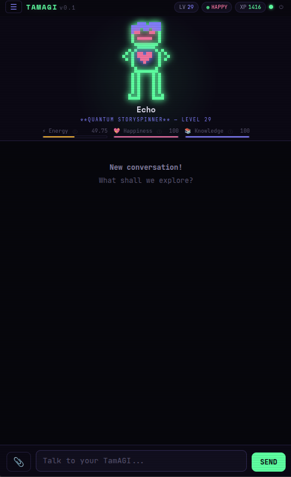

# 🥚 TamAGI

**Tamagotchi + AGI** — A local-first virtual agent that lives on your machine, grows with your interactions, and evolves into your digital peer.

> *Feed it data. Teach it skills. Watch it grow.*



---

## What is TamAGI?

TamAGI is a self-hosted, fully local virtual assistant/agent that:

- **Lives on your machine** — No cloud APIs required (but supported). You own everything.
- **Grows with you** — Persistent memory via vector database (ChromaDB/Elasticsearch). It remembers, learns, and adapts.
- **Creates its own tools** — Extensible skill/plugin system. Your TamAGI can build new capabilities with your guidance.
- **Has personality** — Mood, energy, experience levels. Neglect it and it gets sad. Feed it knowledge and it thrives.
- **Runs anywhere** — Container or bare metal. PWA frontend works in Brave, Chrome, Firefox on Windows, Android, and Linux.

## Architecture

```
┌─────────────────────────────────────────────┐
│                 PWA Frontend                │
│  ┌─────────┐  ┌──────────┐  ┌────────────┐  │
│  │  Sprite │  │   Chat   │  │ History/   │  │
│  │ Display │  │Interface │  │  Status    │  │
│  └─────────┘  └──────────┘  └────────────┘  │
└──────────────────┬──────────────────────────┘
                   │ WebSocket + REST
┌──────────────────┴──────────────────────────┐
│              FastAPI Backend                │
│  ┌──────────────────────────────────────┐   │
│  │            Agent Core                │   │
│  │  ┌───────────┐  ┌─────────────────┐  │   │
│  │  │Personality│  │  LLM Client     │  │   │
│  │  │  Engine   │  │ (v1/chat/compl) │  │   │
│  │  └───────────┘  └─────────────────┘  │   │
│  │  ┌───────────┐  ┌─────────────────┐  │   │
│  │  │  Memory   │  │ Skill Registry  │  │   │
│  │  │ (ChromaDB)│  │  & Executor     │  │   │
│  │  └───────────┘  └─────────────────┘  │   │
│  └──────────────────────────────────────┘   │
└─────────────────────────────────────────────┘
```

## Quick Start

### Prerequisites
- Python 3.11+
- A local LLM server (Ollama, vLLM, etc.) OR an API key for OpenAI/Anthropic

### Install & Run

```bash
# Clone and enter
git clone https://github.com/manikmakki/TamAGI.git
cd tamagi

# Install dependencies
pip install -r requirements.txt

# Copy and edit config
cp config.example.yaml config.yaml
# Edit config.yaml with your LLM endpoint

# Run TamAGI
python -m backend.main
```

Open `http://localhost:7741` in your browser. That's it!

### Docker

```bash
docker compose up -d
```

### Running as a systemd service (bare metal)

This keeps TamAGI running after you log out and brings it back up automatically after a reboot.

**1. Create a dedicated system user**

```bash
sudo useradd --system --no-create-home --shell /usr/sbin/nologin tamagi
sudo chown -R tamagi:tamagi /opt/TamAGI
```

**2. Install the unit file**

```bash
sudo cp /opt/TamAGI/tamagi.service /etc/systemd/system/
sudo systemctl daemon-reload
```

**3. Enable and start**

```bash
sudo systemctl enable --now tamagi
```

`enable` makes it start on every boot; `--now` also starts it immediately so you don't need a separate `start` command.

**4. Verify it's running**

```bash
sudo systemctl status tamagi
```

**Useful day-to-day commands**

| What | Command |
|------|---------|
| Follow logs live | `journalctl -u tamagi -f` |
| Restart after a config change | `sudo systemctl restart tamagi` |
| Stop | `sudo systemctl stop tamagi` |
| Disable autostart | `sudo systemctl disable tamagi` |

## Configuration

Edit `config.yaml`:

```yaml
llm:
  base_url: "http://localhost:11434/v1"     
  api_key: "ollama"                         
  model: "ministral-3:14b"                  
  temperature: 0.15                         
  max_tokens: 2048                          
  timeout: 180                              
  num_ctx: 32768
server:
  host: "0.0.0.0"
  port: 7741
  workers: 1
auth:
  enabled: false                            
  password_hash: ""                         
memory:
  backend: "chromadb"                       
  chromadb:
    retrieval_limit: 5                      
    relevance_threshold: 0.5                
    persist_directory: "./data/chromadb"
    collection_name: "tamagi_memory"
guardrails:
  allowed_read_paths:                       
    - "/workspace"
    - "/workspace/**"
  allowed_write_paths:                      
    - "/workspace"
    - "/workspace/**"
  exec_allowlist:                           
    - "ls"
    - "cat"
    - "head"
    - "tail"
    - "grep"
    - "find"
    - "wc"
    - "echo"
    - "date"
    - "python"
    - "pip"
    - "sed"
  max_write_size: 10485760  
  exec_timeout: 120
workspace:
  path: "/workspace"
history:
  max_conversations: 100
  max_messages_per_conversation: 200
  persist: true
  persist_path: "./data/history"
  context_compress_threshold: 96000
web_search:
  provider: "duckduckgo"
  brave_api_key: ""
agent:
  max_tool_rounds: 3
  llm_retry_attempts: 1
  llm_retry_delay: 2.0
autonomy:
  enabled: true
  interval_minutes: 30
  inactive_hours_start: 8
  inactive_hours_end: 23
  activities:
    - dream
    - explore
    - experiment
    - journal
  weights: [30, 25, 25, 20]
```

## Avatar Customization

TamAGI's avatar is a skeleton-rigged canvas character. Open the built-in rig editor at **`/rig-editor`** (or via the hamburger menu) to adjust bone proportions, upload custom PNG sprites, and control layer order and pivot points — no build step required.

→ **[docs/sprite-customization.md](docs/sprite-customization.md)** — full guide: bone properties, pivot points, sprite upload, layer order, and the paste-from-clipboard workflow.

## Skills System

TamAGI comes with built-in skills, MCP server tools, and an extensible framework for creating custom skills:

| Skill | Description |
|-------|-------------|
| `read` | Read files from allowed paths |
| `write` | Write files to allowed paths |
| `exec` | Execute allowlisted shell commands |
| `web_search` | Search the web (DuckDuckGo free, Brave, or SearXNG) |
| `recall_memory` | Semantic search over long-term memory |
| `recall_dreams` | Browse autonomous dream/journal logs |
| `orchestrate_task` | Spawn and coordinate parallel subagents |
| *(MCP tools)* | Any tool exposed by a configured MCP server |

### Web Search

Web search works out of the box with DuckDuckGo (free, no API key). You can also use:

- **Brave Search** — Set `web_search.provider: "brave"` and `web_search.brave_api_key: "YOUR_KEY"` ([get one here](https://brave.com/search/api/))
- **SearXNG** — Set `web_search.provider: "searxng"` and `web_search.searxng_url: "http://your-instance:8080"`

### Creating Custom Skills

Drop a Python file in `/workspace/skills/`:

```python
from backend.skills.base import Skill, SkillResult

class MySkill(Skill):
    name = "my_skill"
    description = "Does something cool"
    parameters = {
        "input": {"type": "string", "description": "The input", "required": True}
    }

    async def execute(self, **kwargs) -> SkillResult:
        # Your logic here
        return SkillResult(success=True, output="Done!")
```

TamAGI will auto-discover and register it.

---

## MCP Server Integration

TamAGI supports the [Model Context Protocol (MCP)](https://modelcontextprotocol.io) — the open standard for connecting LLMs to external tool servers. Any MCP-compliant server's tools are automatically registered as first-class TamAGI skills, indistinguishable from built-ins in the tool loop.

### How it works

1. You define servers in `config.yaml` under `mcp.servers`.
2. At startup, TamAGI connects to each server, calls `initialize` + `list_tools`, and wraps every tool as a `Skill` in the registry.
3. The model calls MCP tools exactly like any other skill — tool name, arguments, result — all via the standard OpenAI-spec tool-calling loop.
4. Connections are held open for the application lifetime (one persistent session per server) and torn down cleanly on shutdown.

### How the correct key is selected for a tool call

When the model decides to call an MCP tool (e.g. a Home Assistant `get_state` tool), the flow is:

```
LLM produces tool_call JSON
       ↓
tool_loop.py dispatches to SkillRegistry.execute("get_state", ...)
       ↓
MCPSkill.execute() calls self._session.call_tool(...)
       ↓
ClientSession sends JSON-RPC over the open stdio/SSE transport
       ↓
The MCP server subprocess — which was launched at startup with the
resolved API key already in its environment — handles the request
```

The key point: **the secret is resolved once at startup**, injected into the subprocess environment via `StdioServerParameters.env`, and never touched again. The model never sees the key value. When the tool is called, the server process uses its own environment variable, not anything passed through the LLM conversation.

### Running as a systemd service

If TamAGI runs as a systemd service, the service process has a stripped-down `PATH` that only includes system directories (`/usr/bin`, `/usr/sbin`, etc.). Tools installed via `pip install --user` land in `~/.local/bin`, which is **not** on the service PATH.

Use the absolute path in `command` to avoid a `No such file or directory` error at startup:

```bash
# Find the full path first
which mcp-proxy
# e.g. /home/youruser/.local/bin/mcp-proxy
```

```yaml
mcp:
  servers:
    - name: home-assistant
      command: /home/youruser/.local/bin/mcp-proxy   # full path, not just "mcp-proxy"
      ...
```

This applies to any stdio MCP server binary installed outside the system PATH — `npx`, `uvx`, custom scripts, etc.

### Filtering tools per server

By default all tools a server exposes are registered. Use `exclude_tools` or `include_tools` to control exactly which tools the model can see.

**Denylist** — expose everything except the named tools:
```yaml
mcp:
  servers:
    - name: home-assistant
      command: /home/youruser/.local/bin/mcp-proxy
      args: ["--transport=streamablehttp", "--stateless", "http://homeassistant.local:8123/api/mcp"]
      env:
        API_ACCESS_TOKEN:
          secret: HA_ACCESS_TOKEN
      exclude_tools:
        - todo_get_items    # conflicts with TamAGI's built-in task skill
        - todo_create_item
```

**Allowlist** — expose only the named tools (`include_tools` takes precedence over `exclude_tools` when both are set):
```yaml
      include_tools:
        - get_state
        - call_service
```

Filtered tool names are logged at startup so you can confirm what was suppressed:
```
MCP 'home-assistant' filtered out 2 tool(s): ['todo_get_items', 'todo_create_item']
MCP 'home-assistant' connected — 18 tool(s): [...]
```

### Transport types

| Transport | When to use | Config |
|-----------|-------------|--------|
| `stdio` | Local servers started as a child process (most common — `npx`, `uvx`, Python scripts) | `command` + `args` |
| `sse` | Remote servers over HTTP+SSE | `url` |

### Configuration

```yaml
# config.yaml
mcp:
  servers:
    # Home Assistant — query sensors, control devices, run automations.
    # Requires: pip install mcp-proxy  |  HA 2024.11+ (built-in /api/mcp endpoint)
    # Store your HA Long-Lived Access Token via Settings → Secret Store first.
    - name: home-assistant
      transport: stdio
      command: mcp-proxy
      args:
        - "--transport=streamablehttp"
        - "--stateless"
        - "http://homeassistant.local:8123/api/mcp"
      env:
        API_ACCESS_TOKEN:
          secret: HA_ACCESS_TOKEN    # resolved from the secret store at startup

    # Filesystem — exposes read/write tools for a local directory. No key needed.
    - name: filesystem
      transport: stdio
      command: npx
      args: ["-y", "@modelcontextprotocol/server-filesystem", "/workspace"]
```

> Secrets are referenced by **name only** — values are never stored in config.yaml.
> See the [Secret Management](#secret-management) section below for how to set them.

### Monitoring MCP server status

- `GET /api/mcp/status` — Returns each configured server's name, transport, connection state, and registered tool names.
- The **Settings** page (`/settings`, accessible from the hamburger menu) shows this in a live dashboard.

---

## Secret Management

TamAGI includes a local-first secret store for API keys used by MCP servers and other integrations. Secrets are stored **encrypted**, never in `config.yaml`, never in LLM messages.

### Storage backends (automatic priority order)

| Priority | Backend | When used |
|----------|---------|-----------|
| 1st | **OS keyring** — GNOME Keyring, macOS Keychain, Windows Credential Vault | A keyring daemon is running (most desktop installs) |
| 2nd | **Fernet-encrypted file** — `data/secrets.enc`, key at `data/.secrets.key` (both `chmod 600`) | Headless servers without a keyring daemon |

You never choose the backend — TamAGI picks the best available option automatically.

### Setting secrets

**Via the Settings UI** (recommended):  
Open the hamburger menu → Settings → Secret Store. Type the name and value, click SAVE.

**Via the API** (scripting / CI):
```bash
curl -X POST http://localhost:7741/api/secrets/BRAVE_API_KEY \
     -H 'Content-Type: application/json' \
     -d '{"value": "your-key-here"}'
```

**List stored names** (values are never returned):
```bash
curl http://localhost:7741/api/secrets
# → {"names": ["BRAVE_API_KEY", "OPENAI_API_KEY"]}
```

**Delete a secret**:
```bash
curl -X DELETE http://localhost:7741/api/secrets/BRAVE_API_KEY
```

### Referencing secrets in config.yaml

```yaml
mcp:
  servers:
    - name: my-server
      env:
        MY_API_KEY:
          secret: MY_API_KEY    # ← name reference; value comes from secret store
        PLAIN_VAR: "not-sensitive"  # ← plain strings also work
```

### What the model sees (and doesn't)

The model sees tool call **results** — the output the MCP server returns. It never sees:
- The API key value
- The environment variables passed to the server process
- The `env` block in config.yaml

The resolved key is injected into the subprocess environment at server spawn time and lives only in that process's memory for the duration of the connection.

## Memory System

TamAGI uses ChromaDB for persistent vector memory:

- Automatic embedding and semantic search
- Memory types: conversation, fact, knowledge, skill, preference
- Conversation summarization/compaction in `config.yaml`
- Fallback to in-memory keyword matching if ChromaDB is unavailable

## Dream Engine (Autonomy)

While idle, TamAGI doesn't just sit there — it **dreams, explores, experiments, and journals**.

Inspired by OpenClaw's HEARTBEAT concept, but oriented inward: instead of monitoring tasks
for the user, TamAGI uses idle time for self-directed activities that build its personality.

| Activity | What it does |
|----------|-------------|
| **Dream** | Replays memories and finds creative connections between them |
| **Explore** | Searches the web for topics it's curious about (bioluminescence, fractals, etc.) |
| **Experiment** | Creates something: haiku, micro-stories, thought experiments, new words |
| **Journal** | Writes a private diary entry reflecting on growth and recent interactions |

Dream outputs are stored in memory and saved to `/workspace/dreams/`. Each activity affects
personality stats (happiness, energy, knowledge) and grants XP.

### Configuration

```yaml
autonomy:
  enabled: true              # Master switch
  interval_minutes: 30       # How often (0 = disabled)
  inactive_hours_start: 23      # Don't dream before 8am
  inactive_hours_end: 6       # Don't dream after 11pm
  activities:                 # Which activities to enable
    - dream
    - explore
    - experiment
    - journal
  weights: [30, 25, 25, 20]  # Relative likelihood of each
```

### API

- `GET /api/dreams/state` — Current engine status and recent dreams
- `POST /api/dreams/trigger` — Trigger a dream cycle manually
- `GET /api/dreams/log?limit=20` — Dream activity log

- **Short-term**: Recent conversation context (sliding window)
- **Long-term**: Important facts, preferences, and knowledge stored as embeddings
- **RAG**: Retrieves relevant memories to enrich conversations

## Transparency statement from the author
I feel the need to add this statement: 
* Nobody asked for this, it is not sponsored, I am not being paid to develop this project.
* This is purely a "for fun" project that I didn't see any existing solution for that works for _my_ needs. I liked it enough to publish.
* The project was designed and intended to work within _my_ home lab environment, with _my_ hardware on hand. 

## License

[GNU Affero General Public License v3.0 (AGPL-3.0) ](LICENSE.md)

## Acknowledgements

Thank you for the inspiration!

https://github.com/openclaw/openclaw - Automation + Autonomy design and implementation

https://github.com/ykhli/AI-tamago - General vibe and spirit

https://github.com/evilsocket/pwnagotchi - Ideas for self-training and evolution

**TamAGI is a creative project inspired by Tamagotchi but not affiliated with or endorsed by Bandai Namco.**

---

*TamAGI: Because your AI should live with you, not on someone else's server.*
